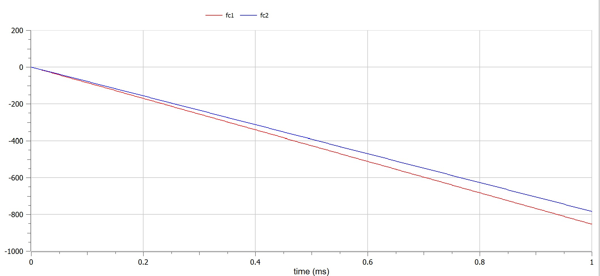
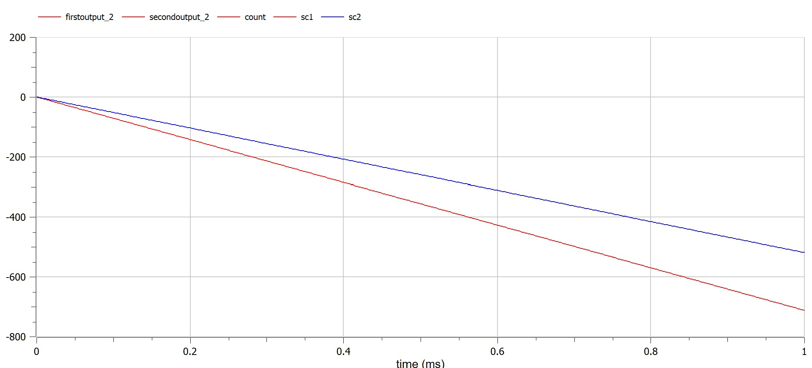
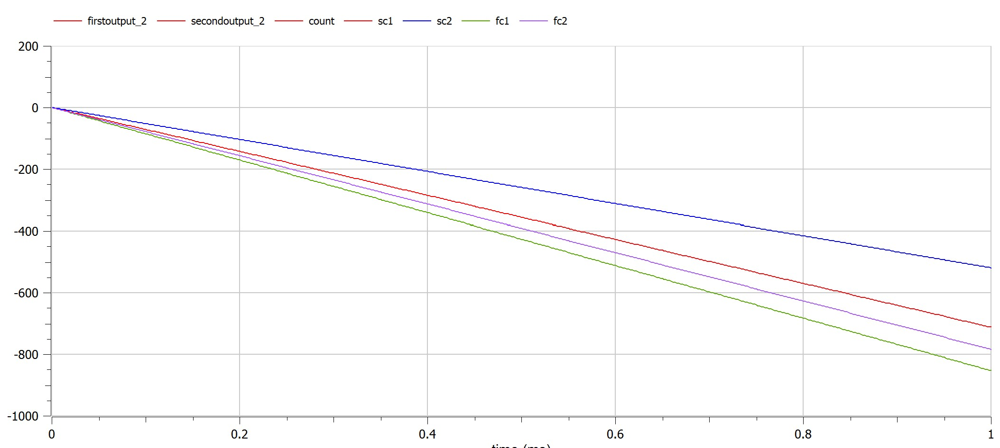
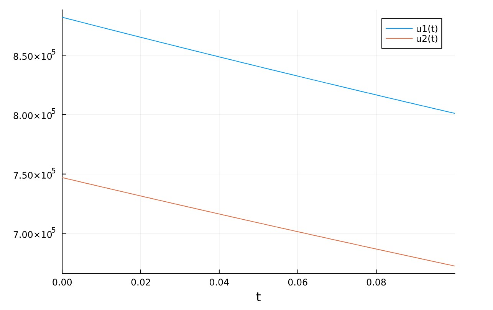
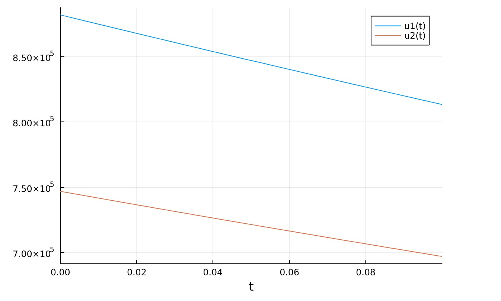

---
## Front matter
title: "Шаблон отчёта по лабораторной работе"
subtitle: "Лабораторная работа № 3"
author: "Мерич Дорук Каймакджыоглу"

## Generic otions
lang: ru-RU
toc-title: "Содержание"

## Bibliography
bibliography: bib/cite.bib
csl: pandoc/csl/gost-r-7-0-5-2008-numeric.csl

## Pdf output format
toc: true # Table of contents
toc-depth: 2
lof: true # List of figures
lot: true # List of tables
fontsize: 12pt
linestretch: 1.5
papersize: a4
documentclass: scrreprt
## I18n polyglossia
polyglossia-lang:
  name: russian
  options:
	- spelling=modern
	- babelshorthands=true
polyglossia-otherlangs:
  name: english
## I18n babel
babel-lang: russian
babel-otherlangs: english
## Fonts
mainfont: PT Serif
romanfont: PT Serif
sansfont: PT Sans
monofont: PT Mono
mainfontoptions: Ligatures=TeX
romanfontoptions: Ligatures=TeX
sansfontoptions: Ligatures=TeX,Scale=MatchLowercase
monofontoptions: Scale=MatchLowercase,Scale=0.9
## Biblatex
biblatex: true
biblio-style: "gost-numeric"
biblatexoptions:
  - parentracker=true
  - backend=biber
  - hyperref=auto
  - language=auto
  - autolang=other*
  - citestyle=gost-numeric
## Pandoc-crossref LaTeX customization
figureTitle: "Рис."
tableTitle: "Таблица"
listingTitle: "Листинг"
lofTitle: "Список иллюстраций"
lotTitle: "Список таблиц"
lolTitle: "Листинги"
## Misc options
indent: true
header-includes:
  - \usepackage{indentfirst}
  - \usepackage{float} # keep figures where there are in the text
  - \floatplacement{figure}{H} # keep figures where there are in the text
---

# Цель работы

Решить проблему и узнать о моделах боевых действий – модели Ланчестера.

Узнать о языке modelica и редакторе соединений openmodelica.

# Теоретическое введение
### Законы Осипова — Ланчестера
**Законы Ланчестера (законы Осипова — Ланчестера)** — математическая формула для расчета относительных сил пары сражающихся сторон — подразделений вооруженных сил. В статье «Влияние численности сражающихся сторон на их потери», опубликованной журналом «Военный сборник» в 1915 году, генерал-майор Корпуса военных топографов М. П. Осипов описал математическую модель глобального вооружённого противостояния, практически применяемую в военном деле при описании убыли сражающихся сторон с течением времени и, входящую в математическую теорию исследования операций, на год опередив английского математика Ф. У. Ланчестера. Мировая война, две революции в России не позволили новой власти заявить в установленном в научной среде порядке об открытии царского офицера.
### OpenModelica
{#fig:000}

**OpenModelica** — свободное открытое программное обеспечение для моделирования, симуляции, оптимизации и анализа сложных динамических систем. Основано на языке Modelica.

Активно развивается Open Source Modelica Consortium, некоммерческой неправительственной организацией. Open Source Modelica Consortium является совместным проектом RISE SICS East AB и Линчёпингского университета.

OpenModelica используется в академической среде и на производстве. В промышленности используется в области оптимизации энергоснабжения,[5] автомобилестроении[6] и водоочистке.[7]

Включает блоки

- механики
- электрики
- электроники
- электродвигатели
- гидравлики
- термодинамики
- элементы управления и т. д.

По своим возможностям приближается к таким вычислительным средам как Matlab Simulink, Scilab xCos, имея при этом значительно более удобное представление системы уравнений исследуемого блока (фактически без существенного преобразования и без сведения к форме Коши, остаётся лишь задать начальные условия и записать уравнения в скоростях).

Имеется возможность компилировать код блоков для дальнейшего внедрения в Matlab и Scilab xCos, а также подключать Matlab-блоки к OpenModelica.

# Выполнение лабораторной работы
```
a = (1032204917 % 70) + 1
println("Вариант ", a)
```
- Вариант 38
    
начальный момент времени страна Х имеет армию численностью 882.000 человек, а в распоряжении страны У армия численностью в 747.000 человек. Для упрощения модели считаем, что коэффициенты a b c h , , , постоянны. Также считаем P(t) и Q(t) непрерывные функции. Постройте графики изменения численности войск армии Х и армии У для
следующих случаев:
- Модель боевых действий между регулярными войсками
$$\frac{dx}{dt}=-0,4x(t)-0,67y(t)+sin(3t)+1$$
$$\frac{dy}{dt}=-0,77x(t)-0,14y(t)+cos(2t)+2$$
- Модель ведение боевых действий с участием регулярных     войск и партизанских отрядов
$$\frac{dx}{dt}=-0,24x(t)-0,67y(t)+|sin(2t)|$$
$$\frac{dy}{dt}=-0,47x(t)-0,14y(t)+|cos(2t)|$$

### openmodelica
```
model lab03
  // first case:
  parameter Real a1 = 0.4; // degree of influence of various factors on losses
  parameter Real b1 = 0.67; // efficiency for army y
  parameter Real c1 = 0.77; // efficiency for army x
  parameter Real h1 = 0.14; // degree of influence of various factors on losses
  
  // second case:
  parameter Real a2 = 0.24;
  parameter Real b2 = 0.67;
  parameter Real c2 = 0.47;
  parameter Real h2 = 0.14;
  // consts:
  parameter Real x = 882000;
  parameter Real y = 747000;
  
  Real fc1;
  Real fc2;
  Real sc1;
  Real sc2;
equation
// firstcase:
  der(fc1) = (-a1)*x + (-b1)*y + sin(3*time) + 1;
  der(fc2) = (-c1)*x + (-h1)*y + cos(2*time) + 2;
// secondcase:
  der(sc1) = (-a2)*x + (-b2)*y + abs(sin(2*time));
  der(sc2) = (-c2)*x + (-h2)*y + abs(cos(2*time));
end lab03;
```
- первый случай

{#fig:001}

- вторый случай

{#fig:002}

- оба случаи

{#fig:003}

### julia

```
using DifferentialEquations
using Plots
```
```
a1 = 0.4
b1 = 0.67
c1 = 0.77
h1 = 0.14
a2 = 0.24
b2 = 0.67
c2 = 0.47
h2 = 0.14
xa = 882000
yd = 747000
t0 = 0
tmax = 0.1
u = [xa;yd]
ts = (t0,tmax)
s = collect(LinRange(0,tmax,100))
```
```
function P1(t)
return sin(3*t)
end
function P2(t)
return abs(sin(2*t))
end
function Q1(t)
return cos(2*t)
end
function Q2(t)
return abs(cos(2*t))
end
```
```
function firstcase(dy,y,p,t)
    dy[1] = -a1*y[1] - b1*y[2] + P1(t) + 1
    dy[2] = -c1*y[1] - h1*y[2] + Q1(t) + 2
end
fc = ODEProblem(firstcase,u,ts)
fcs = solve(fc,saveat=s)
plot(fcs)
```
- первый случай

{#fig:004}
```
function secondcase(dy,y,p,t)
    dy[1] = -a2*y[1] - b2*y[2] + P2(t)
    dy[2] = -c2*y[1] - h2*y[2] + Q2(t)
end
sc = ODEProblem(secondcase,u,ts)
scs = solve(sc,saveat=s)
plot(scs)
```
- вторый случай

{#fig:005}

# Выводы

завершил вопрос, решил его и в julia, и в openmodelica, узнал о Законы Ланчестера.

# Список литературы{.unnumbered}

::: [modelica](https://ru.wikipedia.org/wiki/Modelica) {#refs:modelica}

::: [openmodelica](https://openmodelica.org) {#refs:openmodelica}

::: [julia](https://julialang.org) {#refs:julia}

::: [Законы_Осипова_—_Ланчестера](https://ru.wikipedia.org/wiki/Законы_Осипова_—_Ланчестера) {#refs:Законы_Осипова_—_Ланчестера}


