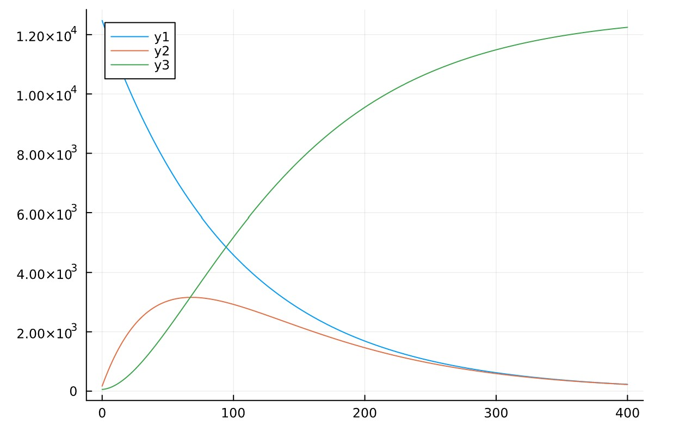

---
## Front matter
title: "Шаблон отчёта по лабораторной работе"
subtitle: "Лабораторная работа № 6"
author: "Мерич Дорук Каймакджыоглу"

## Generic otions
lang: ru-RU
toc-title: "Содержание"

## Bibliography
bibliography: bib/cite.bib
csl: pandoc/csl/gost-r-7-0-5-2008-numeric.csl

## Pdf output format
toc: true # Table of contents
toc-depth: 2
lof: true # List of figures
lot: true # List of tables
fontsize: 12pt
linestretch: 1.5
papersize: a4
documentclass: scrreprt
## I18n polyglossia
polyglossia-lang:
  name: russian
  options:
	- spelling=modern
	- babelshorthands=true
polyglossia-otherlangs:
  name: english
## I18n babel
babel-lang: russian
babel-otherlangs: english
## Fonts
mainfont: PT Serif
romanfont: PT Serif
sansfont: PT Sans
monofont: PT Mono
mainfontoptions: Ligatures=TeX
romanfontoptions: Ligatures=TeX
sansfontoptions: Ligatures=TeX,Scale=MatchLowercase
monofontoptions: Scale=MatchLowercase,Scale=0.9
## Biblatex
biblatex: true
biblio-style: "gost-numeric"
biblatexoptions:
  - parentracker=true
  - backend=biber
  - hyperref=auto
  - language=auto
  - autolang=other*
  - citestyle=gost-numeric
## Pandoc-crossref LaTeX customization
figureTitle: "Рис."
tableTitle: "Таблица"
listingTitle: "Листинг"
lofTitle: "Список иллюстраций"
lotTitle: "Список таблиц"
lolTitle: "Листинги"
## Misc options
indent: true
header-includes:
  - \usepackage{indentfirst}
  - \usepackage{float} # keep figures where there are in the text
  - \floatplacement{figure}{H} # keep figures where there are in the text
---

# Цель работы

Рассмотрить простейшую модель эпидемии. Построить граф эпидемии и изучить его.

# Теоретическое введение
## Задача об эпидемии 
Рассмотрим простейшую модель эпидемии. Предположим, что некая популяция, состоящая из N особей, (считаем, что популяция изолирована) подразделяется на три группы. Первая группа - это восприимчивые к болезни, но пока здоровые особи, обозначим их через S(t). Вторая группа – это число инфицированных особей, которые также при этом являются распространителями инфекции, обозначим их I(t). А третья группа, обозначающаяся через R(t) – это здоровые особи с иммунитетом к болезни. 

До того, как число заболевших не превышает критического значения I, считаем, что все больные изолированы и не заражают здоровых. Когда I(t)>I` , тогда инфицирование способны заражать восприимчивых к болезни особей. Таким образом, скорость изменения числа S(t) меняется по следующему закону:
$$\begin{aligned}
\frac{dS}{dt}= -aS, если I(t)>I` \\
 0, если I(t)\le I`
\end{aligned}$$

Поскольку каждая восприимчивая к болезни особь, которая, в конце концов, заболевает, сама становится инфекционной, то скорость изменения числа инфекционных особей представляет разность за единицу времени между заразившимися и теми, кто уже болеет и лечится, т.е.:

$$\begin{aligned}
\frac{dI}{dt}= aS-\beta I, если I(t)>I` \\
 -\beta I, если I(t)\le I`
\end{aligned}$$

А скорость изменения выздоравливающих особей (при этом приобретающие иммунитет к болезни)

$$\frac{dR}{dt}=\beta I$$

Постоянные пропорциональности a,B - это коэффициенты заболеваемости
и выздоровления соответственно.

Для того, чтобы решения соответствующих уравнений определялось
однозначно, необходимо задать начальные условия .Считаем, что на начало эпидемии в момент времени t = 0 нет особей с иммунитетом к болезни R(0)=0, а число инфицированных и восприимчивых к болезни особей I(0) и S(0) соответственно. Для анализа картины протекания эпидемии необходимо рассмотреть два случая: $$I(0)\le I`$$ и $$I(0)>I`$$

# Выполнение лабораторной работы
```m
a = (1032204917 % 70) + 1
println("Вариант ", a)
```
- Вариант 38

На одном острове вспыхнула эпидемия. Известно, что из всех проживающих на острове (N=12 700) в момент начала эпидемии (t=0) число заболевших людей (являющихся распространителями инфекции) I(0)=170, А число здоровых людей с иммунитетом к болезни R(0)=57. Таким образом, число людей восприимчивых к болезни, но пока здоровых, в начальный момент времени S(0)=N-I(0)- R(0). Постройте графики изменения числа особей в каждой из трех групп. Рассмотрите, как будет протекать эпидемия в случае:

* если I(0)<=I`

```python
"""julia"""
using Plots
using DifferentialEquations

n = 12700
i0 = 170
r0 = 57
s0 = n - i0 - r0
u0 = [s0,i0,r0]
a = 0.01
b = 0.02
tmin = 0
tmax = 400
T = (tmin,tmax)

function func1(dy,y,p,t)
    dy[1] = -a*y[1]
    dy[2] = a*y[1] - b*y[2]
    dy[3] = b*y[2]
end
p1 = ODEProblem(func1,u0,T)
s1 = solve(p1, dtmax=0.01)

plt = plot(s1.t,s1[1,:])
plt2 = plot!(s1.t,s1[2,:])
plt3 = plot!(s1.t,s1[3,:])
```
{pic#001::juliafirstcase}

```m
"""modelica"""
model lab06
Real n = 12700;
Real i0;
Real r0;
Real s0;
initial equation
i0 = 170;
r0 = 57;
s0= n-i0-r0;
equation
der(s0)= -0.01*s0;
der(i0)= 0.01*s0-0.02*i0;
der(r0)= 0.02*i0;
end lab06;
```
{pic#002::modelicafirstcase}

* если I(0)>I`


```python
"""julia"""
using Plots
using DifferentialEquations

n = 12700
i0 = 170
r0 = 57
s0 = n - i0 - r0
u0 = [s0,i0,r0]
a = 0.01
b = 0.02
tmin = 0
tmax = 400
T = (tmin,tmax)

function func2(dy,y,p,t)
    dy[1] = 0
    dy[2] = -b*y[2]
    dy[3] = b*y[2]
end
p2 = ODEProblem(func2,u0,T)
s2 = solve(p2, dtmax=0.01)

plt11 = plot(s2.t,s2[1,:])
plt22 = plot!(s2.t,s2[2,:])
plt33 = plot!(s2.t,s2[3,:])
```
{pic#002::juliasecondcase}

```m
"""modelica"""
model lab06
Real n = 12700;
Real i0;
Real r0;
Real s0;
initial equation
i0 = 170;
r0 = 57;
s0= n-i0-r0;
equation

der(s0)= 0;
der(i0)= -0.02*i0;
der(r0)= 0.02*i0;
end lab06;
```
{pic#002::modelicasecondcase}

# Выводы

Рассмотрен простейшую модель эпидемии. Построен граф эпидемии и изучил его.

# Список литературы{3}

::: [простейший модель эпидемии](https://cyberleninka.ru/article/n/prosteyshaya-matematicheskaya-model-pandemii) {простейший модель эпидемии}

::: [julia](https://julialang.org) {julia}

::: [openmodelica](https://openmodelica.org) {openmodelica}


